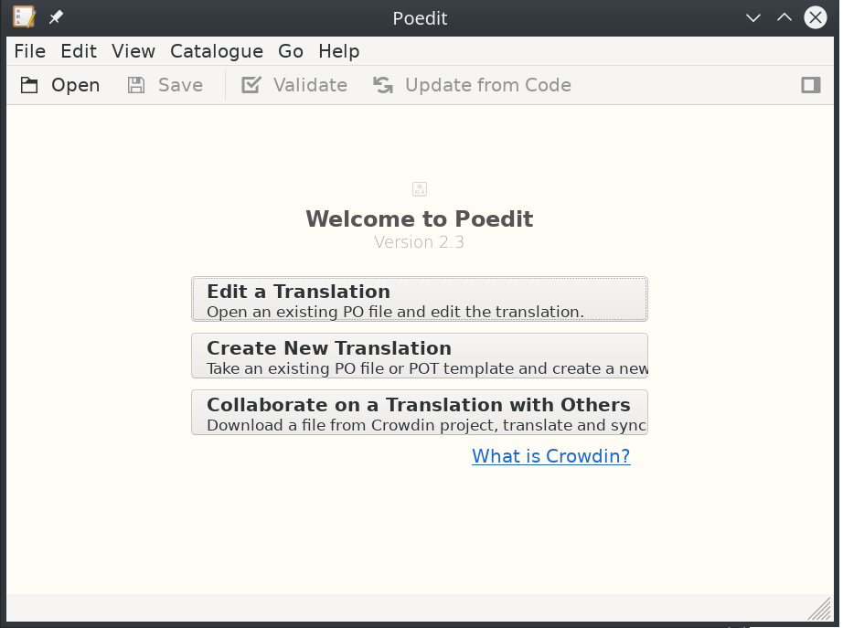
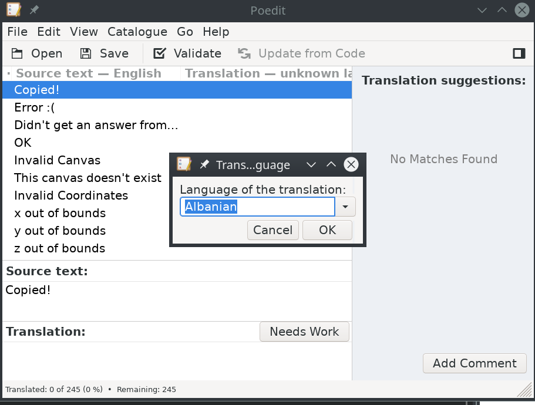
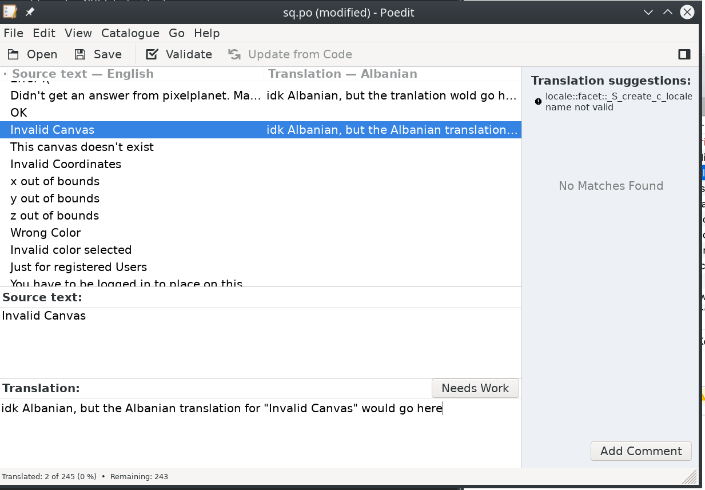

# Translations

Two translation files for each language are needed, `ssr-[locale].po` and `[locale].pb` (i.e. `ssr-de.po` and `de.po`).

Translation files can be created out of the templates [template.pot](https://git.pixmap.fun/ppfun/pixmap/raw/branch/master/i18n/template.pot) and [template-ssr.pot](https://git.pixmap.fun/ppfun/pixmap/raw/branch/master/i18n/template-ssr.pot). They are standard GNU gettext files and can be edited in any ordinary texteditor or po-Editor.

All translated languages get an own chat channel that just people who use this language can access.

If a language code differs from the country code of a wanted flag, it can be defined in the ssr filename, like `ssr-en-gb.po` would be the english language, with the flag of Great Britain.

## With poedit

### Create new translation

1. Download poedit [here](https://poedit.net/) and [template.pot](https://git.pixmap.fun/ppfun/pixmap/raw/branch/master/i18n/template.pot)
2. Open it and **Create new Translation** and open the `template.pot`

3. Select the language you want to translate into

4. Translate all the entries

5. Save the translation as `[locale].po` (i.e. `es.po` for spanish)
6. Do the same again, but with [template-ssr.pot](https://git.pixmap.fun/ppfun/pixmap/raw/branch/master/i18n/template-ssr.pot) and save it as `ssr-[locale].po`
7. Send us the two files on [guilded](https://pixmap.fun) or make a pull request

### Update old translation if change is needed

1. Open the .po file with poedit
2. Click on **Catalogue -> Update** from POT file
3. Select the corresponding template.pot file and the translations will update and new entries appear if needed
